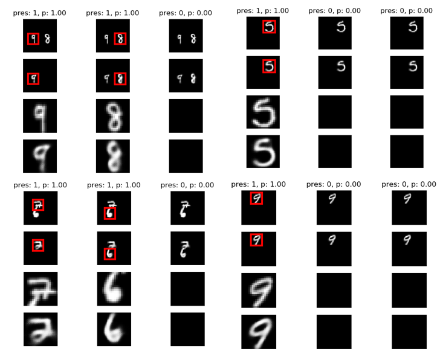
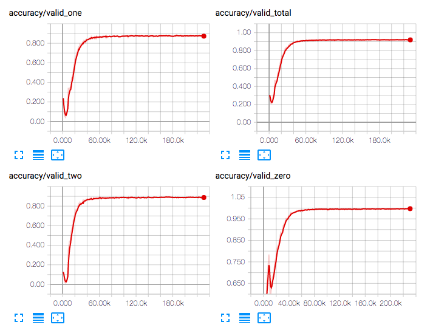

# SQAIR-pytorch
Pytorch Implementation of Sequential Attend, Infer, Repeat.

## AIR

I implemented AIR (neural baseline version) first. I anneal the weight of the reinforce term from 0 to 1 and presence prior probability from 0.5 to 0.01 and these stabilize training. Some localization examples:

Counting accuracy reaches around 92.0%. This is not as good as reported in the paper (over 98%), and this may be an issue of hyperparameters tuning.

